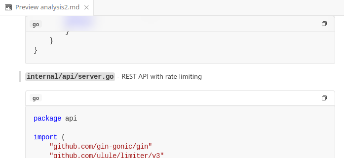
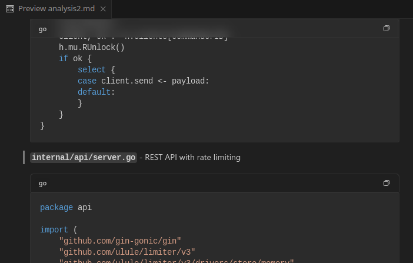

# PreviewBlocks

Additional useful UI [features](FEATURES.md) for code blocks rendering

## Features

- Adds a header for code blocks
- language of code block is displayed in the header as typed
- A copy icon is there to allow one shot copy of code

> Tip: extension uses vscode theme not itself.

## Requirements

- VSCode >= 1.105.0 (may work for older but not tested)
- MD file (currently tested with markdown only)

## Extension Settings

Extention has no custom setting until this version

## Known Issues

you are always welcom to push issues

## Release Notes

See [CHANGELOG](CHANGELOG.md) for more information.

---

## Contribution

- Contribution is always welcome via pull requests
    > I just built the extension for my comfort , but I couldn't implement some features (you could always see [features](FEATURES.md) if you dont inspiration for contribution)
- Issues could be submitted onto github

## Important Notices

- This extension code has no wornaries but keep in mind that if you just introduced the same feature in your extension that mean conflicts could happen ( this extension purpose is better to one external extension rather than same code in each extentions )
- This extension is build with the aid of AI and may have issues that I dont notice , so dont hisitate to submit an issue on any strange behavior

**Enjoy!**
